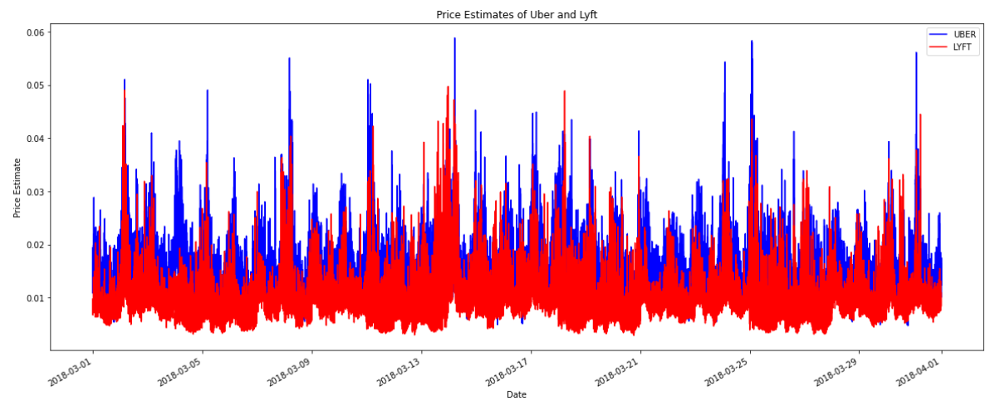
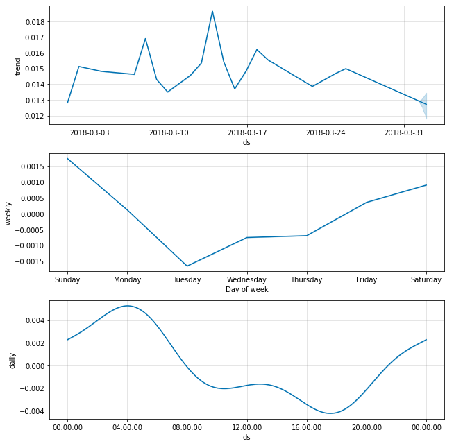

# Availability-and-Price-Prediction-of-Ride-Sharing-Apps-like-Uber_Lyft

## Abstract

Application based transportation system, like Uber and Lyft, has brought new perspective of transportation mode to clients, who can reserve a spot using Mobile applications
conveniently. The capability of a productive ride-sharing plan to essentially decrease traffic, congestion, and drivers’ pressure, just as working with the presentation of brilliant urban communities has been generally shown lately. This positive push anyway is confronted with a few postponing factors, one of which is the instability and unpredictability of the potential benefit of ridesharing at various occasions, and in different places.

## Data Collection
Data was fetched through API’s from real time server. Uber and Lft. The raw data chunks was then put into a csv file and was sent to pre processing steps further.

### Main Dataset
Uber API: https://developer.uber.com/
Lyft API: https://www.lyft.com/developers
Yelp API: https://www.yelp.com/developers

### Connceptual Dataset
1) Events Datasets: 
• Description: The dataset we tried to use was used to estimate the hypothesis for our assessment and was able to define a correlation/feature similarity in prices/availability and traffic caused by different and frequent events. The information for the dataset is decribed as following:
Link: https://data.cityofchicago.org/Events/Public-Health-Department-Events/38sz-xyf4/data

2) Traffic Data set:
• Description: MapQuest is an free open source web mapping service built on crowd-sourced data as an alternative to Google maps. The services provides an real time traffic information API. The API requires: API key ( to uniquely identify each user) and latitude/longitude of area of Chicago. 
Link: http://www.mapquestapi.com/traffic/v2/incidents

## Implementation

### Linear Regression
Linear regression attempts to model the relationship between two variables by fitting a linear equation to observed data. One variable is considered to be an explanatory variable, and the other is considered to be a dependent variable. For example, a modeler might want to relate the weights of individuals to their heights using a linear regression model.

Before attempting to fit a linear model to observed data, a modeler should first determine whether or not there is a relationship between the variables of interest. This does not necessarily imply that one variable causes the other (for example, higher SAT scores do not cause higher college grades), but that there is some significant association between the two variables.

A linear regression line has an equation of the form Y = a + bX, where X is the explanatory variable and Y is the dependent variable. The slope of the line is b, and a is the intercept (the value of y when x = 0). [1]

#### Random Forest Regression
A random forest is a meta estimator that fits a number of classifying decision trees on various sub-samples of the dataset and use averaging to improve the predictive accuracy and control over-fitting.

The Random Forest solves the instability problem using bagging. We simply estimate the desired Regression Tree on many bootstrap samples (re-sample the data many times with replacement and re-estimate the model) and make the final prediction as the average of the predictions across the trees.

There is one small (but important) detail to add. The Random Forest adds a new source of instability to the individual trees. Every time we calculate a new optimal variable-observation point to split the tree, we do not use all variables. Instead, we randomly select 2/3 of the variables. This will make the individual trees even more unstable, but as I mentioned here, bagging benefits from instability.

#### XGB Boost Regression
Extreme Gradient Boosting (XGBoost) is an open-source library that provides an efficient and effective implementation of the gradient boosting algorithm. ... XGBoost is an efficient implementation of gradient boosting that can be used for regression predictive modeling.

**CONCLUSIONS:** We can see that the regression error, random forest error is much less compared to the baseline error, but still significant enough to decrease the accuracy of our prediction.

### Time Series Analysis in Deep Learning with TensorFlow
Deep learning is a machine learning technique that teaches computers to do what comes naturally to humans: learn by example. Deep usually means the number of hidden layers in the neural network. The layers of deep networks can be more than 150. Deep learning models are trained by using large sets of labeled data and neural network architectures that learn features directly from the data without the need for manual feature extraction.

**Long Short Term Memory**
LSTM (Long Short Term Memory networks) don’t have a fundamentally different architecture from RNNs, but they use a different function to compute the hidden state. [3] The memory in LSTMs are called cells and they are used to take the from previous state input and current input. Internally these cells decide what to keep in memory. They then combine the previous state, the current memory, and the input. LSTMs are explicitly designed to avoid the long-term dependency problem as they can remember information for long periods of time. LSTM have chain like structure, but the repeating module has a different structure.

### Time Series Analysis with Moving Average
A Moving Average (rolling average or running average) is a calculation to analyze data points by creating series of averages of different subsets of the full data set.
Given a series of numbers and a fixed subset size, the ** first element ** of the moving average is obtained by taking the average of the ** initial fixed subset ** of the number series. 

**Simple Moving Average**
The simplest form of a moving average, appropriately known as a simple moving average (SMA), is calculated by taking the ** arithmetic mean ** of a given set of values. In other words, a set of numbers, are added together and then divided by the number in the set.

**2. Exponential Moving Average**
However, there is still a probelm, when we calcualte the simple moving average, we use each point in the data series as the same weighting, regardless of where it occurs in the sequence.

But in real analysis, the most recent data is more significant than the older data and should have a greater influence on the final result. So, if we give higher importance to recent data, we can get a new kind of MA Model - ** Exponential Moving Average ** (EMA).

**3. Weighted Moving Average**
By looking at the calculation of the EMA, you will notice that more emphasis is placed on the recent data points, making it a type of ** Weighted Moving Average **.

The WMA is a weighted average of the last n prices, where the weighting decreases with each previous price. This is a similar concept to the EMA, but the calculation for the WMA is different.

(Price X weighting factor) + (Price previous period X weighting factor-1)...

If there are four prices you want a weighted moving average of, then the most recent weighting could be 4/10, the period before could have a weight of 3/10, the period prior to that could have a weighting of 2/10, and so on. 10 is a randomly picked number, and a weight of 4/10 means the most recent price will account for 40% of the value of the WMA. The price three periods ago only accounts of 10% of the WMA value.

### Time Series Analysis with Facebook Prophet
The Facebook Prophet package was released in 2017 for Python and R, and data scientists around the world rejoiced. Prophet is designed for analyzing time series with daily observations that display patterns on different time scales. It also has advanced capabilities for modeling the effects of holidays on a time-series and implementing custom changepoints.

We first import prophet and rename the columns in our data to the correct format. The Date column must be called ‘ds’ and the value column we want to predict ‘y’. We then create prophet models and fit them to the data, much like a Scikit-Learn machine learning model.

**CONCLUSION**
Lyft is generally cheaper than Uber. UberPOOL is generally more expensive during the weekends, especially on Sundays. Its daily trend shows a price surge between 2:00AM and 6:00AM. Lyft Line is generally more expensive during the weekends as well, but especially on Saturdays. Its daily trend shows a price surge between 3:00AM and 5:00AM, which is a shorter window compared to uberPOOL.

